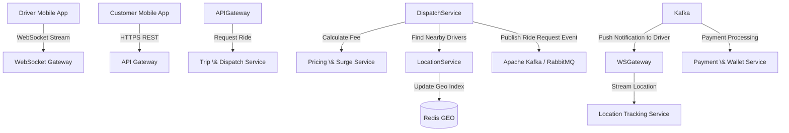

# Ride-Hailing & Logistics — Giai đoạn 0

## Phạm vi MVP đã chốt

**Xe máy · Hà Nội (`HAN`) · Ví nội bộ · VND**. Chưa tích hợp cổng thẻ thật.
Giai đoạn 0 tạo nền tảng build/run/test, chưa triển khai nghiệp vụ đặt xe hoặc giao hàng.
Đề tài và roadmap tổng thể được giữ ở phần cuối README; mô tả Kafka, thanh toán thẻ,
VPS và WebSocket ở đó là mục tiêu về sau, không phải tính năng hiện có.

### Stack

Java **21**, Spring Boot **3.5.16**, Spring Cloud **2025.0.3**, Maven Wrapper **3.9.16**,
PostgreSQL **16 + PostGIS 3.5**, Redis **7.4.9**, Flyway, Testcontainers, Docker Compose.
API Gateway dùng **Server Web MVC** (Tomcat), không dùng WebFlux. Cả bảy app bật
`spring.threads.virtual.enabled=true` và `spring.main.keep-alive=true`.

## Cấu trúc và cổng

| Module | Package sau `com.ridehailing` | Cổng | Status API | Hạ tầng profile `infra` |
| --- | --- | ---: | --- | --- |
| `common` | `common` | — | — | DTO, event, errors, JWT; library JAR |
| `core` | `core` | 8080 | `/api/v1/auth/*` | PostgreSQL database `user`, Redis |
| `user-service` | `user` | 8081 | `/api/v1/users/status` | PostgreSQL database `user` |
| `location-service` | `location` | 8082 | `/api/v1/locations/status` | PostgreSQL `location` + PostGIS, Redis |
| `dispatch-service` | `dispatch` | 8083 | `/api/v1/trips/status` | PostgreSQL `dispatch` |
| `pricing-service` | `pricing` | 8084 | `/api/v1/pricing/status` | Redis |
| `payment-service` | `payment` | 8085 | `/api/v1/payments/status` | PostgreSQL `payment` |
| `ws-gateway` | `wsgateway` | 8001 | `/api/v1/ws-gateway/status` | Redis; chưa có endpoint WebSocket |
| `api-gateway` | `apigateway` | 8000 | `/api/v1/gateway/status` | Chuyển tiếp HTTP tới bảy service |

Mỗi app có `/actuator/health`. Chỉ expose actuator `health,info`, không trả chi tiết
health. Gateway giữ nguyên đường dẫn `/api/v1/...`; không chuyển tiếp actuator upstream.
Các status endpoint là probe kỹ thuật, không phải API nghiệp vụ.

## Build từ máy mới

Yêu cầu **JDK 21**, Git. Docker Desktop/Engine với Linux containers chỉ cần khi chạy
infra, integration tests hoặc Docker apps. Không cần cài Maven nếu dùng Wrapper;
Maven cài sẵn phải là 3.9.x. Enforcer chủ động từ chối Java 17/26 để tránh lệch toolchain.

### Linux/macOS/Git Bash

```bash
export JAVA_HOME="/path/to/jdk-21"
export PATH="$JAVA_HOME/bin:$PATH"
sh scripts/setup-dev.sh
./mvnw verify
# Hoặc nếu đã cài Maven 3.9.x:
mvn verify
```

### Windows PowerShell

```powershell
$env:JAVA_HOME = 'C:\path\to\jdk-21'
$env:Path = "$env:JAVA_HOME\bin;$env:Path"
.\scripts\setup-dev.ps1
.\mvnw.cmd verify
```

`setup-dev` bật `core.hooksPath=.githooks` **chỉ trong repo này**. Git không tự bật hook
khi clone nên mọi thành viên chạy setup một lần. Hook chỉ chạy `spotless:check`,
không tự sửa/stage. Nếu PowerShell policy không cho chạy script, dùng Git Bash
`sh scripts/setup-dev.sh` thay vì đổi policy toàn máy. Trên Unix nếu script chưa có
execute bit, chạy `chmod +x mvnw .githooks/pre-commit scripts/setup-dev.sh`.

### IntelliJ IDEA

Mở root `pom.xml` dưới dạng Maven project; chọn **Project SDK 21** và Maven Runner
JRE **21**, reload Maven để nhận đủ tám module. Không commit `.idea` hoặc `*.iml`.
Thư mục repo có khoảng trắng và `&`: luôn quote đường dẫn khi dùng terminal.

### Format và lint

```bash
./mvnw spotless:apply
./mvnw verify
```

`verify` chạy unit/context tests, packaging, Spotless và Checkstyle. Profile mặc định
`local` loại bỏ auto-config PostgreSQL/Redis để khung rỗng build/start **không cần Docker**;
không thay PostgreSQL bằng H2. Common JAR không được Boot repackage.

## Chạy khung không cần hạ tầng

```bash
./mvnw package
java -jar user-service/target/user-service-0.1.0-SNAPSHOT.jar
curl http://localhost:8081/api/v1/users/status
curl http://localhost:8081/actuator/health
```

Thay tên module để chạy app khác. Override cổng bằng `SERVER_PORT`.

### Core service với JWT authentication

Module `core` đã có đầy đủ authentication flow với JWT:

```bash
# Cần set biến môi trường trước khi chạy:
export JWT_SECRET="your-secret-key-at-least-32-chars-long-for-hs256-algorithm"
export INTERNAL_KEY="your-internal-key"
# PowerShell: $env:JWT_SECRET = "..."; $env:INTERNAL_KEY = "..."

# Chạy với profile infra (cần PostgreSQL và Redis):
export SPRING_PROFILES_ACTIVE=infra
export DB_PASSWORD=user-local-only
java -jar core/target/core-0.1.0-SNAPSHOT.jar

# Test authentication:
curl -X POST http://localhost:8080/api/v1/auth/register \
  -H "Content-Type: application/json" \
  -d '{"email":"test@example.com","password":"password123","fullName":"Test User","role":"CUSTOMER"}'

curl -X POST http://localhost:8080/api/v1/auth/login \
  -H "Content-Type: application/json" \
  -d '{"email":"test@example.com","password":"password123"}'
```

**API endpoints:**
- `POST /api/v1/auth/register` - Đăng ký user (CUSTOMER/DRIVER), tự động tạo wallet
- `POST /api/v1/auth/login` - Đăng nhập, trả về JWT token
- `/api/v1/rides/**` - Yêu cầu JWT token với role CUSTOMER
- `/internal/**` - Yêu cầu header `X-Internal-Key`

**Quy tắc nghiệp vụ:**
- Customer được 500,000₫ ban đầu, driver được 0₫
- Password tối thiểu 8 ký tự, hash bằng BCrypt
- Email phải unique, duplicate trả 409 CONFLICT
- Login sai trả thông báo chung "Invalid credentials" (401)
- JWT token hết hạn sau 1 giờ, chứa userId và role claim

## PostgreSQL/PostGIS và Redis local

```bash
cp .env.example .env
# PowerShell: Copy-Item .env.example .env
docker compose up -d --wait
```

`.env` được ignore; giá trị mẫu chỉ dành cho local. Cổng PostgreSQL/Redis và ứng dụng
bind localhost. PostgreSQL bootstrap tạo bốn database/tài khoản riêng, hạn chế quyền
kết nối giữa các database. PostGIS được cài bởi bootstrap user cho database `location`;
ứng dụng không dùng tài khoản superuser. Mỗi DB service có Flyway migration riêng,
chưa tạo bảng nghiệp vụ. Redis chỉ có namespace convention, chưa có ACL từng service.

Chạy service ngoài Docker với profile `infra` (ví dụ User):

```bash
export SPRING_PROFILES_ACTIVE=infra
export DB_PASSWORD=user-local-only
java -jar user-service/target/user-service-0.1.0-SNAPSHOT.jar
```

Profile infra đọc `DB_URL`, `DB_USERNAME`, `DB_PASSWORD` và, khi dùng Redis,
`REDIS_HOST`, `REDIS_PORT`, `REDIS_PASSWORD`. `.env` được **Compose** đọc, JVM chạy bằng
`java -jar` không tự đọc tệp này; cần export environment variables tương ứng.
Flyway `clean` bị tắt. Health infra kiểm tra DB/Redis thật, không báo UP giả nếu mất kết nối.

Bootstrap chỉ chạy khi volume PostgreSQL mới: đổi password trong `.env` không đổi
password đã lưu. Không xóa volume có dữ liệu; dùng quản trị DB để đổi password.
`docker compose down` giữ volume. `down -v` xóa dữ liệu, chỉ dùng khi chủ động reset local.

## Integration tests và toàn bộ stack Docker

```bash
# Chạy unit tests (không cần Docker):
./mvnw test

# Integration tests cần Docker đang chạy:
./mvnw test -Pintegration
# Hoặc test riêng module core:
./mvnw test -pl core -Pintegration

# Windows: .\mvnw.cmd test -Pintegration

# Multi-stage Java 21 images, runtime non-root:
docker compose --profile apps config --quiet
docker compose --profile apps up --build -d --wait
curl http://localhost:8000/api/v1/users/status
curl http://localhost:8000/api/v1/locations/status
curl http://localhost:8000/actuator/health
```

Profile `integration` chạy các test được đánh dấu `@Tag("integration")`. Mặc định 
`mvn test` loại trừ integration tests để build nhanh không cần Docker.
Testcontainers kiểm tra Flyway migration/validation, PostGIS spatial query, Redis
round-trip và authentication flow. Nếu Docker thiếu, profile integration **fail rõ**, 
không skip ngầm.

Module `core` có 13 integration tests cho JWT authentication:
- Register customer/driver với atomic user+wallet creation
- Login với BCrypt password validation
- Duplicate email returns 409 CONFLICT
- Invalid credentials returns 401 UNAUTHORIZED
- JWT token validation và role-based access control
- `/api/v1/rides/**` chỉ cho CUSTOMER role (403 cho DRIVER)
- `/internal/**` endpoints yêu cầu X-Internal-Key header

Dockerfile dùng chung với build arg `MODULE`; profile `apps` gồm bảy app và hạ tầng.
Để dừng: `docker compose --profile apps down` (không xóa volume).
CI dùng JDK 21, job verify và integration; chưa push Docker image hay deploy VPS.

## Tài liệu và tiêu chí hoàn thành

- [Quy ước package, API, lỗi, event, JWT và virtual-thread pinning](docs/conventions.md).
- [Checklist Giai đoạn 0 và kết quả kiểm chứng](docs/stage-0.md).
- Event schema/ví dụ: `common/src/main/resources/event-schemas/`.
- Hook: `.githooks/pre-commit`; CI: `.github/workflows/verify.yml`.

Xong Giai đoạn 0 khi `mvn verify` dưới **JDK 21** xanh trên khung và thành viên có thể
build bằng hướng dẫn trên. Matching/GPS/pricing/wallet/WebSocket/VPS là các giai đoạn sau.

---

## Đề tài gốc và roadmap tổng thể

ĐỀ TÀI 2: HỆ THỐNG ĐẶT XE VÀ GIAO HÀNG THEO YÊU CẦU THEO THỜI GIAN THỰC (RIDE-HAILING & LOGISTICS SYSTEM)
1. TỔNG QUAN VỀ ĐỀ TÀI
   Tên đề tài: Thiết kế và phát triển hệ thống Đặt xe & Giao hàng thời gian thực (mô hình Grab/Gojek) trên kiến trúc Microservices.
   Mô tả: Hệ thống quản lý kết nối giữa Khách hàng (Passenger/Customer) và Tài xế (Driver), định vị vị trí thời gian thực (Real-time GPS Tracking), tính toán cước phí linh hoạt (Surge Pricing) và ghép nối chuyến xe thông minh (Matching Engine).
   Tính thực tế doanh nghiệp:
   Xử lý hàng trăm ngàn tọa độ GPS gửi lên mỗi giây từ ứng dụng của tài xế.
   Đòi hỏi độ trễ cực thấp trong việc ghép nối tài xế gần nhất với khách hàng.
   Phân tách service giúp đảm bảo nếu tính năng tính cước/khuyến mãi bị quá tải, hệ thống định vị tài xế vẫn hoạt động ổn định.
---
2. PHÂN TÍCH KIẾN TRÚC MICROSERVICES
   2.1. Danh sách các Microservices chính
   API Gateway & WebSocket Gateway:
   Quản lý kết nối HTTP REST và kết nối WebSocket persistent hai chiều với ứng dụng tài xế & khách hàng.
   Công cụ: Nginx / Envoy / Node.js WebSocket Gateway.
   User & Driver Profile Service:
   Quản lý tài khoản khách hàng, hồ sơ tài xế, thông tin xe, bằng lái, trạng thái hoạt động (Online/Offline/Busy).
   Database: PostgreSQL (hoặc MySQL).
   Location & Telemetry Tracking Service (High Throughput Service):
   Tiếp nhận stream tọa độ GPS từ ứng dụng tài xế gửi lên theo chu kỳ 3-5 giây/lần.
   Lưu trữ và cập nhật vị trí mới nhất của tài xế để hỗ trợ truy vấn không gian (Spatial Queries).
   Database: Redis (Redis GEO Data Structure) + PostGIS (PostgreSQL Extension cho Spatial Data).
   Trip & Dispatching Matching Service (Core Engine):
   Nhận yêu cầu đặt xe từ khách hàng -> Tìm kiếm tài xế phù hợp xung quanh bán kính X km -> Gửi đề nghị nhận chuyến tới tài xế.
   Quản lý trạng thái chuyến đi (Requested, Accepted, Arrived, In-Progress, Completed, Cancelled).
   Database: MongoDB hoặc PostgreSQL.
   Dynamic Pricing & Surge Fee Service:
   Tính toán giá tiền dựa trên khoảng cách (Google Maps / OpenStreetMap API), thời gian dự kiến và hệ số nhân nhu cầu (Surge Pricing dựa trên mật độ tài xế vs khách hàng tại khu vực).
   Database: Redis (Lưu cache quy tắc bảng giá).
   Payment & Wallet Service:
   Quản lý ví điện tử tài xế, trừ hoa hồng chuyến đi, thanh toán qua thẻ/ví điện tử cho khách hàng.
   Database: PostgreSQL.
   2.2. Sơ đồ kiến trúc & Cơ chế giao tiếp (Inter-Service Communication)

Truyền nhận dữ liệu thời gian thực (Real-time Streaming):
WebSocket / gRPC Streams: Giữ kết nối liên tục giữa Driver App và `Location Service`.
Event-Driven Architecture:
Khi chuyến đi hoàn thành -> `Dispatch Service` bắn event `TripCompletedEvent`.
`Payment Service` tự động trừ tiền ví/thẻ của khách và cộng tiền vào ví tài xế.
`User Service` cập nhật lịch sử chuyến đi.
---
3. HƯỚNG DẪN TÌM HIỂU VÀ PHÂN TÍCH HỆ THỐNG CHO SINH VIÊN
   Giai đoạn 1: Phân tích Kỹ thuật Xử lý Dữ liệu Không gian (Spatial Indexing)
   Nghiên cứu Redis GEO & H3 Spatial Index (Uber H3 Index):
   Học cách sử dụng lệnh `GEOADD`, `GEORADIUS` / `GEOSEARCH` trong Redis để tìm kiếm tài xế trong bán kính 2km với thời gian phản hồi < 2ms.
   Quản lý trạng thái kết nối WebSocket:
   Giải bài toán khi server WebSocket bị rớt mạng hoặc khi chạy nhiều instance WebSocket Gateway (dùng Redis Pub/Sub để broadcast tin nhắn giữa các instance WebSocket).
   Giai đoạn 2: Thiết kế Matching Engine & State Machine
   Thiết kế Máy trạng thái Chuyến xe (State Machine):
   Vẽ và cài đặt luồng chuyển trạng thái nghiêm ngặt cho chuyến xe: `CREATED` -> `MATCHING` -> `ACCEPTED` -> `PICKING\_UP` -> `IN\_TRIP` -> `COMPLETED`.
   Đảm bảo tránh tình trạng 2 khách hàng đặt cùng 1 tài xế tại 1 thời điểm (Concurrency Control / Atomic Lock).
   Giai đoạn 3: Phân tích Tính toán cước giá động (Surge Pricing)
   Thu thập Metrics:
   Đếm số lượng yêu cầu tạo chuyến (Supply) vs số tài xế rảnh (Demand) trong cùng một geohash (ô lưới địa lý) theo từng khung giờ.
---
4. HƯỚNG DẪN TRIỂN KHAI LÊN SERVER VPS THỰC TẾ
   Step 1: Chuẩn bị Hạ tầng VPS
   Cấu hình tối thiểu đề xuất: Cloud VPS (Ubuntu 22.04 LTS, 4 vCPU, 8GB RAM, SSD 60GB).
   Yêu cầu kết nối mạng: VPS cần có IP Tĩnh Public (Elastic IP) và độ trễ thấp.
   Step 2: Cấu hình Containerization & Networks
   Tạo file `docker-compose.yml`:
   Khởi chạy các container: `ws-gateway`, `api-gateway`, `user-service`, `location-service`, `dispatch-service`, `pricing-service`, `payment-service`.
   Khởi chạy Infra containers: `Redis (Geo enabled)`, `PostgreSQL with PostGIS`, `Apache Kafka + Zookeeper`.
   Step 3: Cấu hình Nginx Reverse Proxy cho WebSocket
   Cấu hình Nginx trên VPS để proxy cả HTTP REST và WebSocket (Upgrade HTTP header):
```nginx
server {
    server\_name ride-api.yourdomain.com;

    # HTTP REST APIs
    location /api/v1/ {
        proxy\_pass http://localhost:8000;
        proxy\_set\_header Host $host;
        proxy\_set\_header X-Real-IP $remote\_addr;
    }

    # Real-time WebSocket connection
    location /ws/ {
        proxy\_pass http://localhost:8001;
        proxy\_http\_version 1.1;
        proxy\_set\_header Upgrade $http\_upgrade;
        proxy\_set\_header Connection "Upgrade";
        proxy\_set\_header Host $host;
        proxy\_read\_timeout 86400s; # Giữ kết nối lâu dài không bị timeout
    }
}
```
Step 4: Triển khai SSL & HTTPS với Certbot
Cấp chứng chỉ WSS (Secure WebSocket) và HTTPS giúp ứng dụng di động / web kết nối an toàn mà không bị trình duyệt chặn tin cậy.
Step 5: Tự động hóa CI/CD
Tự động build Docker Image trên GitHub Actions, push lên Registry và SSH vào VPS thực thi câu lệnh:
```bash
docker compose pull ws-gateway location-service dispatch-service
docker compose up -d --no-deps ws-gateway location-service dispatch-service
```
(Chiến lược Rolling Update đảm bảo ứng dụng không bị gián đoạn kết nối thời gian thực).
---
5. TIÊU CHÍ ĐÁNH GIÁ & YÊU CẦU BÀI LÀM CHO SINH VIÊN
   Tính thời gian thực (Real-time Performance): Vị trí tài xế cập nhật liên tục và hiển thị mượt mà trên bản đồ khách hàng qua WebSocket với độ trễ < 500ms.
   Khả năng ghép chuyến (Matching Accuracy): Hệ thống gửi tín hiệu đặt xe đến đúng tài xế đang rảnh và ở gần nhất.
   Triển khai VPS thực tế: Chạy hệ thống trên VPS thực, kiểm tra kết nối SSL/WSS từ mạng ngoài thành công.
   Kịch bản Demo & Chịu tải:
   Viết script Python / Node.js giả lập 100 tài xế di chuyển ảo và gửi tọa độ GPS liên tục lên VPS.
   Thực hiện thao tác đặt xe từ ứng dụng khách hàng thực tế và kiểm tra tài xế ảo nhận được chuyến.
